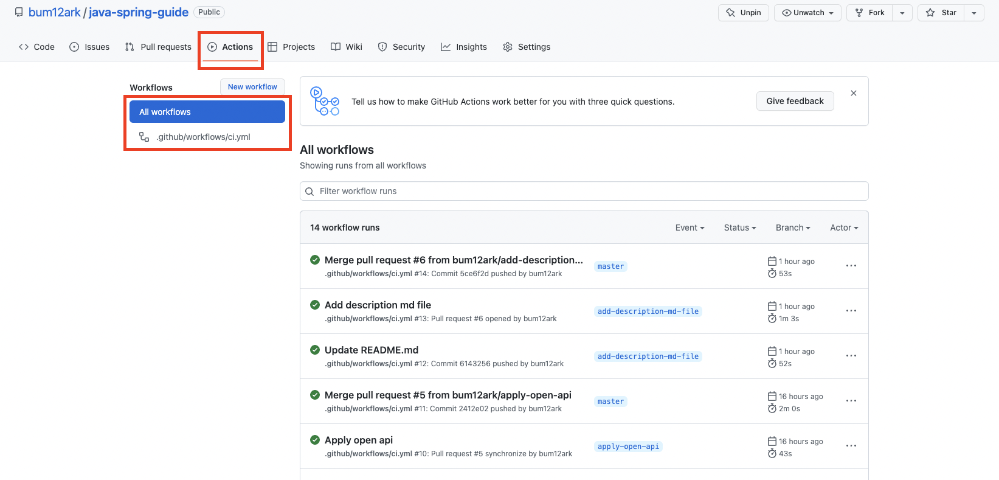
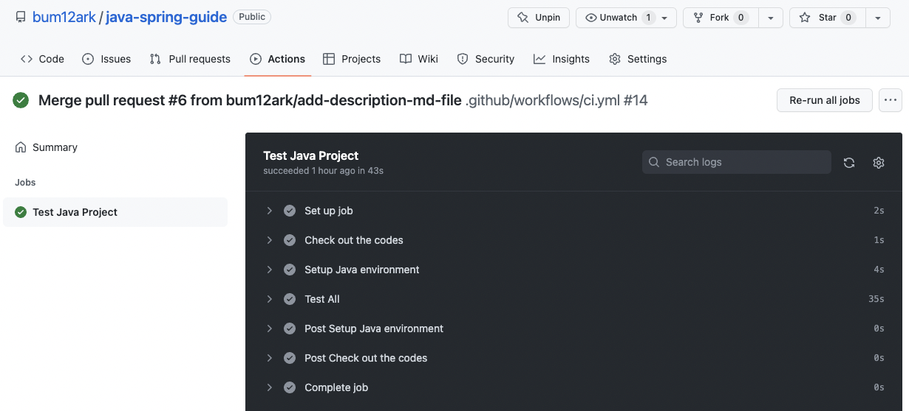
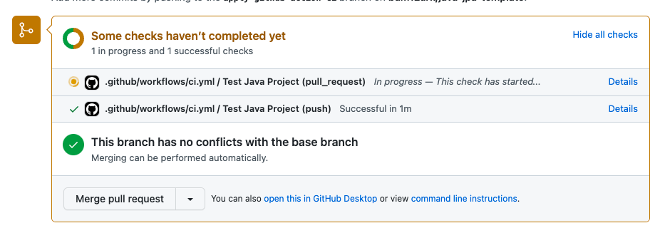

# CI (Github Actions)

## GitHub Actions

- 빌드, 테스트 및 배포 파이프라인을 자동화할 수 있는 CI/CD(지속적 통합 및 지속적 전달) 플랫폼
- 리포지토리에 대한 모든 PR을 빌드 및 테스트하는 workflow를 생성하거나 Merg된 PR을 프로덕션에 배포할 수 있음
- GitHub는 workflow를 실행하기 위한 Linux, Window, macOS 가상 머신을 제공하거나 클라우드 인프라에서 자체 호스팅기를 호스팅할 수 있음

### 구성요소


1. Workflow
    - 하나 이상의 작업을 실행하는 구성 가능한 자동화 프로세스
    - 리포지토리의 `.github/workflows` 디렉터리에 정의되며 각각 다른 작업 집합을 수행할 수 있는 여러 워크플로가 있을 수 있음
    - 다른 워크플로 내에서 워크플로를 참조할 수 있음
2. Event
    - 워크플로 실행을 트리거하는 리포지토리의 특정 활동 (PR 생성, commit이 특정 branch에 push 될 때,…)
3. Job
    - 동일한 Runner에서 실행되는 여러 Step의 집합
    - 기본적으로 하나의 Workflow 내의 여러 Job은 독립적으로 실행되지만, 필요에 따라 의존 관계를 설정하여 순서를 지정 가능
4. Action
    - Job을 만들기 위해 Step을 결합한 독립적인 커맨드로, 재사용이 가능한 Workflow의 가장 작은 단위의 블럭
5. Runner
    - Github Actions Workflow 내에 있는 Job을 실행시키기 위한 애플리케이션

## 적용법

```yaml
# workflow를 실행시키기 위한 Event 목록
on:
  push:
  pull_request:

# workflow의 Job 목록
jobs:
  # Job의 이름
  ci:
    name: Test Java Project
    # Runner가 실행되는 환경
    runs-on: ubuntu-latest
    # ci Job의 Step 목록
    steps:
      # uses를 통해 Action을 불러올 수 있음
      - name: Check out the codes
        uses: actions/checkout@v2
      - name: Setup Java environment
        uses: actions/setup-java@v3
        # with을 통해 전달되는 입력맵을 제공 가능
        with:
          distribution: 'temurin'
          java-version: '17'
          cache: 'gradle'
      - name: Test All
        run: |
          ./gradlew clean build -i
```

- `.github/workflows` 디렉터리에 push와 pull_request에 대한 워크플로우를 추가합니다.
- [Workflow syntax link](https://docs.github.com/en/actions/using-workflows/workflow-syntax-for-github-actions)

## GitHub에서 확인하기



- `respository > Actions` 탭에서 workflow들을 확인 가능



- workflow를 선택하여 Summary 및 각 Step의 실행 결과를 확인 가능



- PR 생성 시 설정한 Event(push, pull_request)에 맞게 GitHub Actions가 실행되는 것을 확인 가능

## Reference

- [https://docs.github.com/en/actions](https://docs.github.com/en/actions)