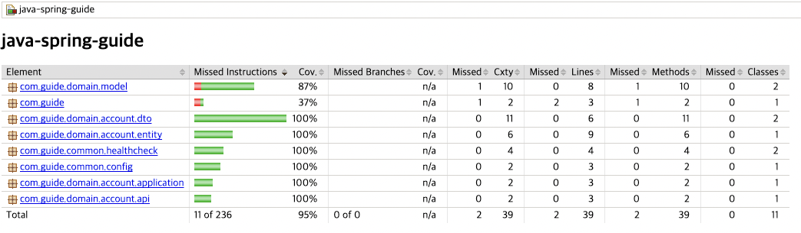

# 코드 커버리지 (Jacoco)

## 코드 커버리지란

- 테스트 코드가 프로덕션 코드를 얼마나 실행했는지를 백분율로 나타내는 지표
- 테스트 코드가 실제 프로덕션 코드를 몇 퍼센트 검증하고 있는지를 나타낸다.
- 코드 커버리지의 중요성은 테스트 코드의 중요성과 일맥상통

### 구문(Statement)

- 라인 커버리지
- 코드 한 줄이 한 번 이상 실행된다면 충족

### 조건 (Condition)

- 모든 조건식의 내부 조건이 true/false을 가지게 되면 충족
- 각 내부 조건 참 혹은 거짓을 가지면 충족

### 결정 (Decision)

- 브랜치 커버리지
- 모든 조건식이 true/false를 가지게 되면 충족
- 각 분기의 내부조건 자체가 아닌 전체의 결과가 참 혹은 거짓을 가지면 충족

## Jacoco

- Jacoco는 Java 코드의 커버리지를 체크하는 라이브러리
- 테스트 코드를 돌리고 그 커버리지 결과를 html, xml, csv 같은 리포트로 생성
- 테스트 결과가 내가 설정한 커버리지 기준을 만족하는지 확인

### 적용법

```kotlin
plugins {
    id("jacoco")
}

tasks.jacocoTestReport {
    dependsOn(tasks.test) // tests are required to run before generating the report
    reports {
        // 원하는 리포트를 켜고 끌 수 있음
        html.required.set(true)
        xml.required.set(false)
        csv.required.set(false)
    }
    // jacocoTestReport 실행 후 jacocoTestCoverageVerification을 실행하도록 설정
    finalizedBy(tasks.jacocoTestCoverageVerification)
}

tasks.jacocoTestCoverageVerification {
    dependsOn(tasks.jacocoTestReport)
    // 커버리지의 기준을 설정
    violationRules {
        rule {
            element = "CLASS"
            limit {
                // 커버리지의 종류를 설정 (구문, 조건, 결정)
                counter = "LINE"
                value = "COVEREDRATIO"
                // 만족해야하는 최소 커버리지를 설정
                minimum = "0.90".toBigDecimal()
            }
            // 테스트에 제외할 클래스를 지정
            excludes = listOf(
                    "com.guide.Application"
            )
        }
    }
}
```

### test task 실행 시 Jacoco task 실행하도록 설정

```kotlin
tasks.test {
    useJUnitPlatform()
    finalizedBy(tasks.jacocoTestReport) // report is always generated after tests run
}

tasks.jacocoTestReport {
    dependsOn(tasks.test) // tests are required to run before generating the report
    // .. (생략) ..
    finalizedBy(tasks.jacocoTestCoverageVerification)
}
```

- test task가 실행될 때 마다 자동으로 jacocoTestReport task와 jacocoTestCoverageVerification task가 순서대로 실행

## 사용법

- `./gradlew jacocoTestCoverageVerification` : 커버리지 기준을 지키는지 확인
- `./gradlew jacocoTestReport` : 커버리지 리포트를 생성

### Jacoco Report 확인하기

- 경로 : `build/reports/jacoco/test/html/index.html`



## Reference

- [https://ko.wikipedia.org/wiki/코드_커버리지](https://ko.wikipedia.org/wiki/%EC%BD%94%EB%93%9C_%EC%BB%A4%EB%B2%84%EB%A6%AC%EC%A7%80)
- [https://docs.gradle.org/current/userguide/jacoco_plugin.html](https://docs.gradle.org/current/userguide/jacoco_plugin.html)
- [https://techblog.woowahan.com/2661/](https://techblog.woowahan.com/2661/)