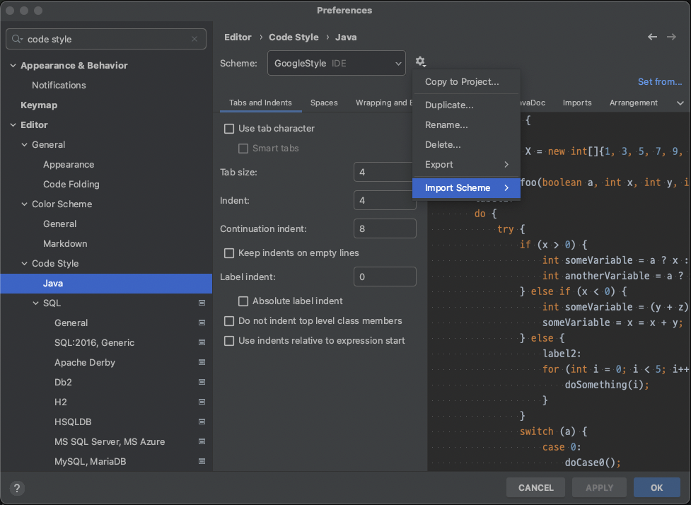

# Spotless (코드 포맷팅)

## Spotless 란

- Keep your code spotless
- 여러 개발자가 협업하는 환경에서 코드 컨벤션을 지키고 쉽게 유지보수하기 위해 사용하는 플러그인
- 컨벤션이 지켜지지 않을 경우 build가 실패함으로 여러 개발자가 컨벤션을 지킬 수 있게 됨

## 적용법

### Install Guide

```kotlin
plugins {
    id("com.diffplug.spotless") version("6.11.0")
}
```

### Setting Guide

```kotlin
spotless {
    java { 
        // import 순서 정의
        importOrder(
                "java",
                "javax",
                "lombok",
                "org.springframework",
                "",
                "\\#",
                "org.junit",
                "\\#org.junit",
                "com.guide",
                "\\#com.guide"
        )
        // 사용하지 않는 import 제거
        removeUnusedImports()
        // 구글 자바 포맷 적용
        googleJavaFormat()

        indentWithTabs(2)
        indentWithSpaces(4)
        // 공백 제거
        trimTrailingWhitespace() 
        // 끝부분 New Line 처리
        endWithNewline()
    }
}
```

## 사용법

- `./gradlew spotlessCheck` : 정해진 컨벤션을 지키고 있는지 검사
- `./gradlew spotlessApply` : 파일에 코드 컨밴션을 적용

## Intellij Setting



- Preferences > Editor > Code Style > Java
- 프로젝트 root path의 `intellij-java-google-style.xml` 파일을 import 하여 인텔리제이에서 설정 가능
- 구글에서는 블록 들여 쓰기를 +2 공백으로 설정하지만 해당 프로젝트에서는 4칸 들여쓰기를 사용
    - `google java format aosp` 에서는 들여쓰기를 4칸으로 설정하고 있음

## Reference

- [https://github.com/diffplug/spotless/tree/main/plugin-gradle#java](https://github.com/diffplug/spotless/tree/main/plugin-gradle#java)
- [https://github.com/google/google-java-format](https://github.com/google/google-java-format)